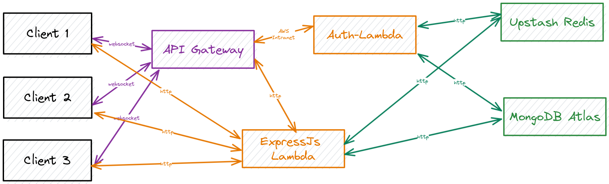
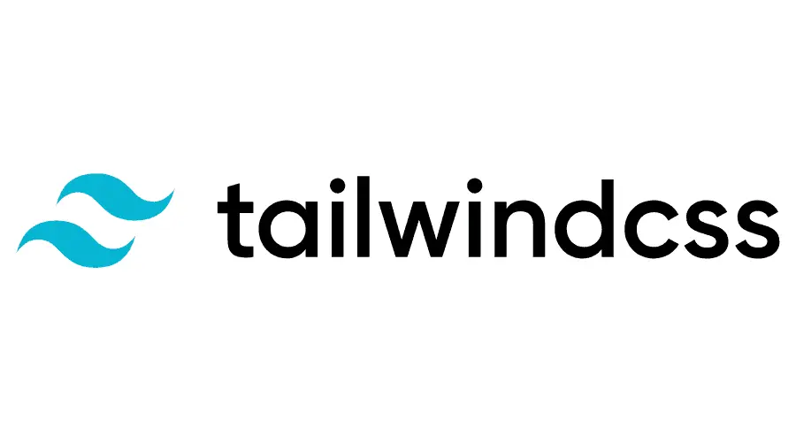
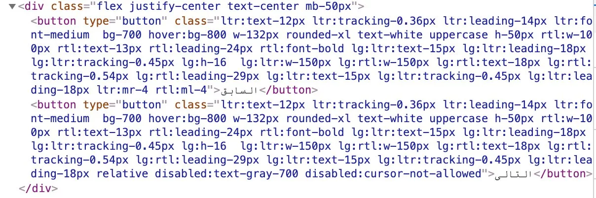
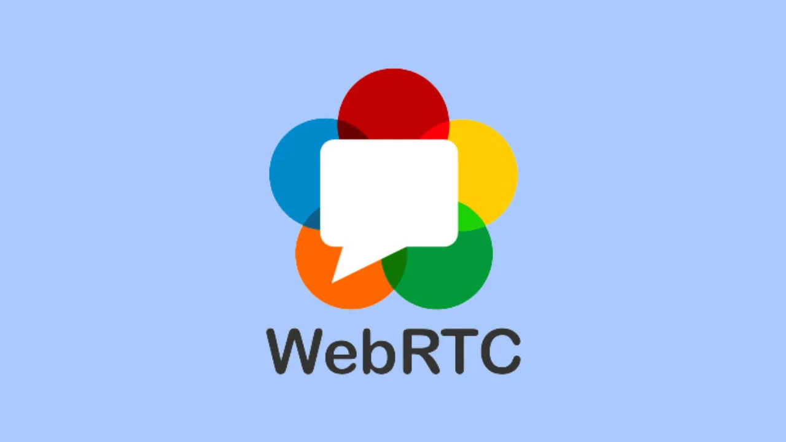
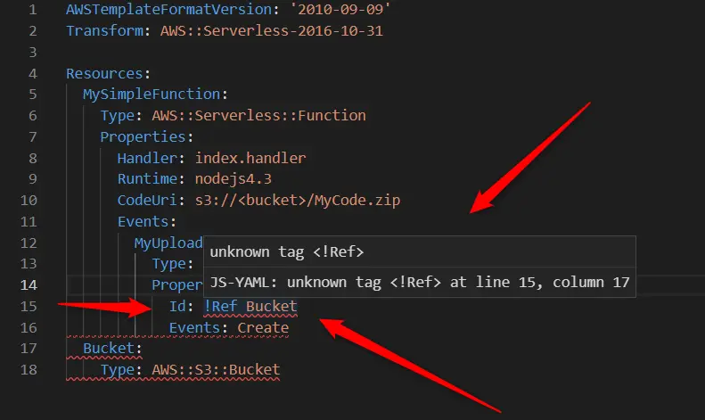
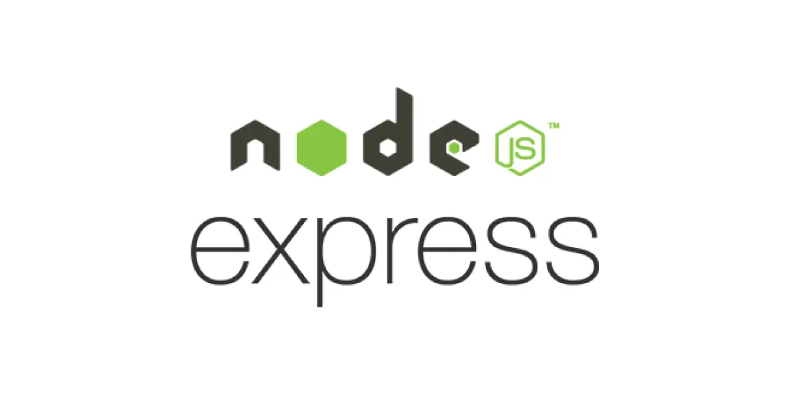
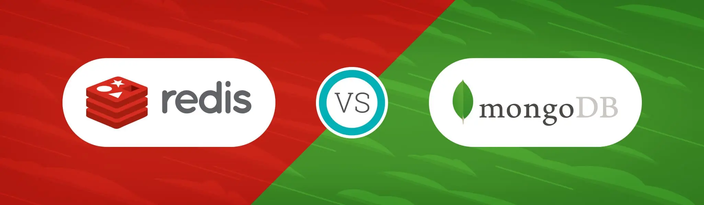

# Talki
Talki is a *serverless, decentralized video calling* app. This was my first **MERN-stack** project, and I wanted to go all in on the stack. The stack providers were chosen mainly based on economic viability, namely the existence of a free tier. But planning out a [WebRTC](https://webrtc.org/) flow, which is itself pretty esoteric and contrived, while being a noob at [AWS](https://aws.amazon.com/), is *intimidating*, to say the least.

## The System Design
This next image contains the entire flow for starting a new group video call. If you're actually interested in the flow, the diagram has it all. I've not explicitly mentioned the actual AWS services I used, in the diagram. This way, it is setup and vendor agnostic. I meditated on this flow for days before implementing it in code; so I was pretty confident when I actually sat down to do the wiring.

The way that the infrastructure is actually implemented is as follows:

### Hosting the front/back-end
The clients visit the static website hosted on [GitHub Pages](https://pages.github.com). The website talks to the [Express](https://expressjs.com/) backend, which is hosted on [AWS Lambda](https://aws.amazon.com/lambda/). This kind of setup gives a great scalability benefit. Since the frontend is completely static, it is easily cached on Github Pages' CDN. Scaling that to meet requests is no longer our concern, since GitHub Pages acts like a managed service. Similarly, the backend, being hosted on AWS Lambda, is by its very nature scalable. It seamlessly scales to meet any number of requests. Since the Express backend is based on HTTP (which is inherently stateless), the clients are not attached to any single server. 

### Authenticate, then talk
The users are authenticated using [session cookies](https://developer.mozilla.org/en-US/docs/Web/HTTP/Cookies). The cookies are *Cross-Origin HTTP-Only Secure Cookies*, that are stored on a managed [Redis](https://redis.com/) service. Users have the option of authenticating themselves either anonymously (with a psuedonym), or with [Google OAuth2](https://developers.google.com/identity/protocols/oauth2). If user's choose to authenticate with Google, a tick mark is shown next to their name, indicating that they are a verified user. The Google OAuth2 in this case, is being handled with a [JWT](https://jwt.io/) generated by google, that contains the user's data. The authenticity of this token is verified via the [Google-Auth-Library](https://www.npmjs.com/package/google-auth-library). Since this is a basic authentication, there is no secret key being used on the server side. Such a case is only necessary in the case of Authorization requirements to manipulate the user's Google Account. This app does not need such permissions.

Once they're authenticated, users have the ability to *create* or *join* a room. This information about the Room and the members in it is stored on a managed [MongoDB](https://www.mongodb.com/) service as document. The document itself has an expiry time of 5 minutes. This is due to the fact that our [WebSocket](https://developer.mozilla.org/en-US/docs/Web/API/WebSockets_API) is provided by a managed service([AWS API Gateway](https://aws.amazon.com/api-gateway/)) that is charged by the second; and not by a persistent server, in which case we could have simply kept the WebSocket connected for a longer time. Instead, I made the judgement that *after 5 minutes, new users are not likely to join the existing room*. If in case the group does wish to add a new user, they are free to create a new room, which essentially restarts their timer. On the other hand this prevents having a live WebSocket connection, which is pretty much unused, for the duration of the call.

### WebSockets
Once a user creates or joins a room, they receive credentials to join the room via WebSocket. These credentials are included via [URL parameters](https://developer.mozilla.org/en-US/docs/Web/API/URLSearchParams) while establishing the WebSocket connection. This again is to accomodate the fact that our WebSocket is a managed service (AWS API Gateway), that doesn't offer cookie based authentication. If we were self-hosting the WebSocket server, it would have been relatively easy to authenticate requests, using the existing cookies. However, API Gateway exists on a different origin, and we are not able to set cookies for it from our Express backend. So I used a *nonce* or a *One-Time-Password* that allows a user to establish a WebSocket connection. 

The WebSocket is being hosted on AWS API Gateway. This is a managed service that can seamlessly scale to any number of WebSocket connections, preventing the need for us to have a persistent WebSocket connection between the client and server. API Gateway itself, acts like middleman, routing requests to the Express Backend Lambda. API Gateway is itself a fully featured backend service that provides the ability to setup HTTP routes, and link them to processing code via Lambda. This is called a *Multi-Lambda* setup or a *Single-Function Api*. However, my intention was to build the entire backend in Express, so I went with a *Mono Lambda* setup.

The way it works is that for every event (such as `$connect`, `$disconnect`) that occurs on the API Gateway WebSocket, the event data is channeled to the Express backend, via an *HTTP proxy* over the public internet. The Express backend, being hosted on a Lambda, is accessible via its *Function URL*, over the public internet. This is a new feature that is provided free of cost, by AWS. Earlier, to trigger a Lambda run we had to setup an API Gateway HTTP integration, with a catchall route, acting as a proxy. This earlier method was an additional cost, which is removed in the new Function URL setup.

AWS recommends that you link the handler Lambda to the API Gateway WebSocket via a *Function Integration*. This is routed over AWS Intranet, preventing our Lambda from being accessed over the public internet. However going this route would increase our backend Infrastructure complexity, by creating a *Multi-Lambda setup*. So I went for a more elegant solution of simply routing the requests over the public internet, to the same Express backend.

There is however, the issue of security that arises with this approach. Technically, anybody can hit the Express backend routes that manipulate the WebSocket. This opens up the possibility of unauthorized tampering by third-parties, with other people's chat rooms. In order to solve this, I had to implement some sort of authentication, ensuring that API Gateway was the only person interacting with these routes dealing with the WebSocket events. For this, I used the `connectionId` of each user's WebSocket connection, as a unique password. This is a value that is randomly generated byAPI Gateway. I made sure that this value is not leaked to the client. So effectively, this becomes a *password authorizer*, unique to each user, that can only be sent by API Gateway. *Nice!*

A small problem did arise however, with this authentication process. As I mentioned earlier, since the WebSocket and Express Backend are hosted on different origins, the strategy used to authenticate users is a simple *nonce*. However, if the credentials provided by the user are invalid, it is incredibly difficult to deny the user's connection via the HTTP-integrated Express Backend. This is due to the fact that the connection is not technically established, until the Express integration finishes executing; and hence how can you disconnect something that isn't connected yet. Another option would have been to map HTTP response codes to different actions directly on the API Gateway infrastructure. But this would place logic inside API Gateway, which I did not intend to do. My intention was to keep API Gateway as a mere dumb middleman(or a traffic-cop, like the design pattern), who routes requests to my smart Express backend.

So in order to solve this conundrum, I used AWS's native solution of *Authorizer Lambda*'s. This is a standalone function, that does some logic to determine whether the connecting user is legitimate or not. The user's credentials were being passed as URL parameters. The authorizer lambda simply verifies this with the database, and accepts or rejects the new connection.

By adding this additional lambda, we have broken away from our *Mono Lambda* setup. However, the complexity of this approach was less than all of the other alternatives.

After a user is authorized to connect via WebSocket, we need a way to recognize their chat room, on all subsequent requests. In order to do this, as soon as they are authorized, their WebSocket connectionId is added to the Room Document on the MongoDB database. 

The 'pure' way to do this would have been to add the user to the Room Document, from within the Express Backend $connect integration. However, there were several benefits to simply conducting this logic from within the Authorizer lambda. Namely:
1. One Less Lambda was invoked.
2. The Database connections and Room Document was already accessed for the Authorization. This was very little additional work.
3. Eliminated additional latency for the request; as Express integration is over public HTTP, whereas Authorizer Lambda is integrated natively via AWS Intranet

So the connect route HTTP integration is unnecessary. It has been substituted with a *mock integration* on API Gateway.

### After connecting
Once the user is connected, there are two possible paths:
1. If the user isn't allowed in the room yet, we prompt the admin for permission
2. If the user already exists in room, we ask all of the existing connected members to connect to this new user.

The admin user is always allowed in the room. All of the other users however, need to be specifically allowed by the admin. This only has to be done once, however. So on all recurring visits to the same room, such as the case of page refreshes, the other members are asked to connect immediately.

Here, when we talk about members connecting to other members, we're referring to WebRTC connection. For real time media streaming applications, WebRTC is a big improvement over WebSockets; both in terms of latency, and cost. It also provides the ability to scale infinitely, as each connection is scoped between its two users. So for n members, each member needs to maintain (n-1) connections; resulting in a total of nC2 or (n^2 - n)/2 connections.

In this manner, the backend is only necessary for adding new members, by providing the I.D's of, and a means to reach the people in a specific room. After the room expires, the WebRTC connections persist indefinitely, allowing the users to continue their conversation.

### Databases 
The databases used here are in the form of managed services. Cost was the primary consideration for this choice; namely the existence of a free tier. 

For MongoDB, [MongoDB Atlas](https://www.mongodb.com/atlas/database) service was used. Currently this is on a shared cluster, and not the serverless option, since that is the only option under free tier. This can easily be switched to the serverless option, should the need (and the traffic) ever arise. It is especially easy, since we are not storing any information about the users on our databases, long-term.

For Redis, [Upstash Redis](https://upstash.com/) was used. This provides a serverless Redis instance, that has a very generous free tier. The user sessions have been setup to expire after 24 hours. That prevents data from being stored on the disk for too long. Since it's pretty quick to log in, that should not be much of an issue to any users either.

## A few thoughts on the Stack:

### Astro (with a pinch of preact)
[Astro](https://astro.build/) is great.. *until you need some javascript*. But most of the things you build for a website, don't need to *React* to things happening. Plus, the cleanliness of fetching data right where you need it, instead of passing it down through 700 components *(I'm looking at you, Next.js 12)* is tough to beat. 

For anything dynamic though, [React](https://reactjs.org/) is just **beautiful**. I tried making vanilla JS work with astro. But I realized that I **hate** the fake dependency inversion provided by `document.getElementById`. On top of that, despite how shitty prop drilling may be, there's a certain peace of mind that comes with knowing exactly where your data comes from. Compared to that, this is what Vanilla JS gives you.

But bringing in react would eliminate all of the size benefits that come with astro. *Enter, [PREACT](https://preactjs.com/)*. All of the familiarity of react. None of the bulk. Got me up and running in minutes.

### Tailwind
Although I've used [tailwind](https://tailwindcss.com/) before, this is the first portfolio project I've used it in. When I first came across tailwind, I thought
> This is just inline styles. Who in their right mind would use this?

I already knew [Material-UI](https://www.mui.com) at this point. So this wasn't really providing anything that the `sx` prop didn't. However, several months and codebases later, setting up tailwind is one of the first things I do! 

Don't get me wrong, the criticism remains. One of the worst things about tailwind, is **debugging CSS**; and that's all thanks to the inline mess that it is. But despite its shortcomings, tailwind has its highlights.

1. Incredibly easy and quick to setup with any stack
2. More than enough for 95% of the components' styles. (You can always use custom css)
3. No unused classes. (You might forget to delete styles when modifying)
4. No single use classes. (`.this-container`,`.that-container` )
5. No specificity problems (Each combination is scoped to the element)
6. It's just CSS (No generating via JS, super performant)

### WebRTC
I first came across WebRTC in this video by Theo. (The embedded player below is a 10 second clip highlighting the exact reference). 

<iframe width="560" height="315" src="https://www.youtube.com/embed/rzwaaWH0ksk?clip=UgkxNoq3pLpfw9gfk-sUoG-1RUYXPbjq9lFo&amp;clipt=EJCCQxjQ2UM" title="YouTube video player" frameborder="0" allow="accelerometer; autoplay; clipboard-write; encrypted-media; gyroscope; picture-in-picture; web-share" allowfullscreen></iframe>

When I saw that, I immediately thought:
> Wow, live video! That seems impressive

So of course, I had to try it for myself. Turns out, its painfully contrived. After watching a couple of videos from [Fireship](https://www.youtube.com/watch?v=WmR9IMUD_CY) and [Hussein Nasser](https://www.youtube.com/watch?v=FExZvpVvYxA), I still didn't have a clear understanding of it. So I built out a barebones WebRTC app, without a signalling server (I did it manually using good old `Ctrl+C, Ctrl+V`). Finally I understood the required order of events.

The main benefit I saw to using WebRTC was that as soon as I connected the clients, my server could leave the scene. Why should I bear the charge for the users bandwidth, you know? Plus, the real-time-stream nature of the data demanded either HLS or WebRTC to be used. But I don't need different encodings; and moreover 10-20 seconds of latency is enough to kill any conversation. But most importantly, I can't afford a stateful server. So HLS is a big no no.

Next step, scale this for infinite users; and use AWS while you're at it. That took a while, to say the least.

### AWS
The big cahuna. Understanding a single service is difficult enough for a beginner. But orchestrating multiple services in an idempotent fashion, was a real task. When I started my journey, my only experience with AWS was spinning up port 80 node on an EC2. I was determined to stay within the free tier, while ensuring that my app was architected in a fully scalable fashion. So of course, I had to *put it in a lambda*.

I suspect I fall towards the left of this normal distribution 😂. Either way, going the serverless route made a few things pretty clear.
1. I need a persistent database
2. I need a signalling server that can scale like a lambda
3. I need to do everything in AWS

Initially I tried setting things up manually. While this is [a necessary part of the learning process](https://www.youtube.com/watch?v=N4LtCvxVmaA), by the 700th time you upload your handler code, you start to have trust issues with yourself. So I eventually settled on the Infrastructure as Code route, using [AWS Cloudformation](https://aws.amazon.com/cloudformation/).

Initially, I started out with the [serverless framework](https://www.serverless.com/), but that has very little manueverability in terms of extra things(like setting up custom Api Gateway routes, which we will get to in a moment). So I started writing [Cloudformation YAML](https://docs.aws.amazon.com/AWSCloudFormation/latest/UserGuide/template-formats.html).

Now YAML is cool and all. But its bloated af and has no AST. You don't know if what you're writing works until you hit deploy. So I had to migrate again, to [AWS CDK](https://aws.amazon.com/cdk/). So far, I'm loving the autocomplete, and runtime checking(via typescript). It's like having the AWS console inside your code editor. Of course, you always need to learn the stuff from the console, and the [cloudformation documentation](https://docs.aws.amazon.com/cloudformation/index.html), before actually implementing anything. But the setup is pretty robust, and runs beautifully in a CI/CD environment.

#### API Gateway Web Sockets
The problem with putting stuff in a lambda, is that its ephemeral. For a WebRTC session to work, I need a signalling server for the initial connection setup between the clients. I had three options for this:
1. [Long polling](https://www.youtube.com/watch?v=J0okraIFPJ0)
2. [Server Sent Events](https://www.youtube.com/watch?v=4HlNv1qpZFY)
3. [Websockets](https://youtu.be/2Nt-ZrNP22A)

Long polling was my first option, since it had very little extra setup in a node backend. But the whole premise of long polling is delaying the response to a normal HTTP request from the client. But my backend is on lambda. I'm being billed for **every millisecond**! Clearly I could not use a solution that is tailored towards persistent servers. Unfortunately that also means no Server Sent Events or Websockets. Well that's no good! I need some kind of bi-directional communication! *Enter API Gateway*

<iframe width="560" height="315" src="https://www.youtube.com/embed/xtCddOjITvo" title="YouTube video player" frameborder="0" allow="accelerometer; autoplay; clipboard-write; encrypted-media; gyroscope; picture-in-picture; web-share" allowfullscreen></iframe>

[This video from codedamn](https://www.youtube.com/watch?v=xtCddOjITvo) brought to my attention the existence of a service from AWS that was perfect for my lambda setup (Why wouldn't it be, they probably built it specifically for lambda). Now figuring out how to set this up was a real challenge. The technicalities were extremely esoteric. At one point I even thought of just switching to a normal persistent server. But I pulled through (or rather got through the [documentation](https://docs.aws.amazon.com/apigateway/latest/developerguide/apigateway-websocket-api.html)), and this is what I decided was the required architecture.

Figuring this out took a couple of days too😂. Talk about trial by fire. All of this would have been 100 times simpler to just put on a single EC2. But it would have probably cost my wallet a 100 times more too. 

If you look closely at the above image, the websocket is actually proxying requests to my lambda backend via HTTP. AWS recommends that you use their direct Lambda integration to API gateway. That way you can prevent the lambda requests to specific authorized entities (such as API gateway). But I needed my backend to be publicly accessible too, for the frontend requests. Instead of hosting two backends in a multi-lambda fashion, I found it easier to just distinguish between logic handlers via the HTTP url.

But this again came with its own set of problems. How the hell was I supposed to auth requests, when they're coming through the public internet!? Api gateway only authorizes incoming requests, not outgoing proxy requests. I had to carry this information in the request body. I ended up using the connectionId, as a secret key identifying the author of the requests. The frontend is oblivious to this piece of data(I made sure of that); and that guarantees authenticity of requests. 

*Speaking of backend...*

### Express.js (Node.js)
This was not my first time using express and node. However I really polished it up this time. Some things that I implemented, that I'm particularly proud of are:
- **Controlled Explicit and Implicit Error handling:** If the error is unexpected, the frontend is shown a generic message, the logger is engaged, and the server lives on. The explicit errors on the other hand are handled using a dedicated Error class, maintaining error codes and messages. Most importantly, I got rid of the convention of throwing Errors for expected paths, and hoping that somebody will catch it. Instead, when a piece of code is expected to return in a non-happy path (which is pretty standard in HTTP controllers), I return an error object. That way, the error is handled immediately, and mandatorily, at the first level above it.
- **Decorator-style async controller factories:** Sometimes functionality is shared. Sometimes you can't abstract it into a function, because its the loops that are repeated, and not the code. The solution to this is to accept the processing code(that varies between use cases) *as a function* as argument to the function ([Thanks Uncle Bob for this idea](https://youtube.com/clip/UgkxG7RlhaYn1s2If52jegFPHEaBBJGl4fvc)). This roughly does the job of a decorator pattern.
- **Injected Dependency for Database:** Initially the database was being initialized in its own module, similar to a side effect, exposing the client to be used throughout the app. In order to implement connection pooling between lambda invocations, I modified the structure to use an injected dependency for the database clients. This way, it's perfectly clear where the data comes from, and where the processing happens.
- **Cookie based OAuth2:** Nothing unique really. But most of the tutorials I saw online were using a ready-made solution like PassportJS or Okta. I implemented OAuth2 using Google's base API's. That took a while to wrap my head around, but in hindsight, the flow is pretty easy.

### Redis and MongoDB(Mongoose ORM):
I was a bit confused on whether to include two separate databases. I'm not storing any user data long term (*yay privacy!*), so Redis alone should have been able to get the job done. However I decided to go all in, in the interest of future expansion. Redis handles the cookie-sessions, and MongoDB contains the data about the Chat rooms.

I decided to use fully managed services, (cause why shouldn't I) in the form of **MongoDB Atlas** and **Upstash Redis**. I was going to self-host via AWS. But setting up the whole thing with redundancy would mean persistent servers; and persistent servers means $$. I was already down the serverless route; Upstash provided a great serverless redis. MongoDB does have a serverless option, but I just went ahead with the free-tier shared cluster(cause money). I didn't use the Cloudformation templates to setup these third-party services either, cause they're paid resources in AWS Cloudformation.

The downside to being fiscally conservative, is **latency and (maybe) security**. My requests are routed over the public internet. I would have setup VPC peering, but those required paid services. I'll do that if this service ever takes off. Till then, this stuff is fast enough.

This was my first production project with MongoDB and Redis. I found that learning the syntax for either was a pretty atomic task, coming from [Firebase](https://firebase.google.com/)'s repertoire of queries. It is nice to query stuff without worrying about read/write limits. Mongoose's ORM was pretty sweet too. I managed to set it up slightly differently from the official documentation, to ensure that I had type-safe usage throughout.

### Typescript + Zod
This one is pretty much a no-brainer at this point, that's why I put it at the end of the list. Throughout this project, the combination of Typescript and [Zod](https://zod.dev/) has ensured type-safety, both at compile, and run time. Some fancy-word concepts that I have in fact used in this project are: 
- Discriminated Unions
- Type-predicates, 
- Generic Type signatures
- Function overloading
- ES6 classes with private members, getter-setters

### Github Actions CI/CD
Finally, to tie everything together, [Github Actions](https://github.com/features/actions) deploys all of the code; whether it be GitHub pages hosting for the frontend, or AWS for the backend. I did find this CI/CD solution to be really elegant since it required very little additional setup, compared to something like [AWS CodeDeploy](https://aws.amazon.com/codedeploy/). 

The Github Pages hosting via Astro was a simple Github Action, that didn't require any additional setup apart from the environment variables. The CI/CD runner would build the app as usual, and host it.

The Backend lambda's were built using **Vercel's NCC** package, which bundles all of the dependencies into a single file(per lambda). This eliminates the need to upload the entire libraries folder (node_modules) to the lambda runtime, reducing the required size of the lambda. Deploying of these lambdas was done using the AWS CDK package. In order to do this via the Github Actions CI/CD runner, I setup the AWS credentials on github using the trusted provider AWS IAM role, just like they recommend in the official docs. Surprisingly, that was easier than simply creating a new access key.

That's pretty much it. That was a lot of work to get something that's pretty much in every phone right now. I did learn a lot from this one. Here's to more trial-by-fire's I guess! 

*Onward and Upward*
