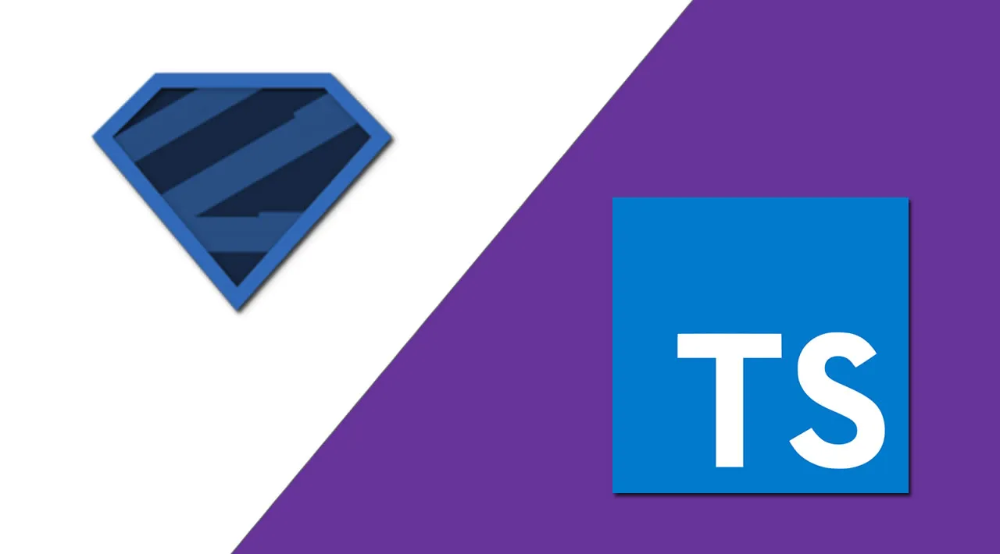

# Talki
Talki is a serverless, decentralized video calling app. This was my first MERN-stack project, and I wanted to go all in on the stack. The stack providers were chosen mainly based on economic viability, namely the existence of a free tier. But planning out a WebRTC flow, which is itself pretty esoteric and contrived, while being a noob at AWS, is *intimidating*, to say the least.

I'm not even gonna bother explaining this next image 😂. If you're actually interested in the flow, the diagram has it all. I meditated on that flow for days before implementing it in code.

## The Stack

### Astro (with a pinch of preact)
Astro is great.. *until you need some javascript*. But most of the things you build for a website, don't need to *React* to things happening. Plus, the cleanliness of fetching data right where you need it, instead of passing it down through 700 components *(I'm looking at you, Next.js 12)* is tough to beat. 

For anything dynamic though, react is just **beautiful**. I tried making vanilla JS work with astro. But I realized that I **hate** the fake dependency inversion provided by `document.getElementById`. On top of that, despite how shitty prop drilling may be, there's a certain peace of mind that comes with knowing exactly where your data comes from. Compared to that, this is what Vanilla JS gives you.

But bringing in react would eliminate all of the size benefits that come with astro. ***Enter, PREACT***. All of the familiarity of react. None of the bulk. Got me up and running in minutes.

### Tailwind
Although I've used tailwind before, this is the first portfolio project I've used it in. When I first came across tailwind, I thought
> This is just inline styles. Who in their right mind would use this?

I already knew Material-UI at this point. So this wasn't really providing anything that the `sx` prop didn't. However, several months and codebases later, setting up tailwind is one of the first things I do! 

Don't get me wrong, the criticism remains. One of the worst things about tailwind, is **debugging CSS**; and that's all thanks to the inline mess that it is. But despite its shortcomings, tailwind has its highlights.

1. Incredibly easy and quick to setup with any stack
2. More than enough for 95% of the components' styles. (You can always use custom css)
3. No unused classes. (You might forget to delete styles when modifying)
4. No single use classes. (`.this-container`,`.that-container` )
5. No specificity problems (Each combination is scoped to the element)
6. It's just CSS (No generating via JS, super performant)

### WebRTC
I first came across WebRTC in this video by Theo. (The embedded player below is a 10 second clip highlighting the exact reference). 

<iframe width="560" height="315" src="https://www.youtube.com/embed/rzwaaWH0ksk?clip=UgkxNoq3pLpfw9gfk-sUoG-1RUYXPbjq9lFo&amp;clipt=EJCCQxjQ2UM" title="YouTube video player" frameborder="0" allow="accelerometer; autoplay; clipboard-write; encrypted-media; gyroscope; picture-in-picture; web-share" allowfullscreen></iframe>

When I saw that, I immediately thought:
> Wow, live video! That seems impressive

So of course, I had to try it for myself. Turns out, its painfully contrived. After watching a couple of videos from [Fireship](https://www.youtube.com/watch?v=WmR9IMUD_CY) and [Hussein Nasser](https://www.youtube.com/watch?v=FExZvpVvYxA), I still didn't have a clear understanding of it. So I built out a barebones WebRTC app, without a signalling server (I did it manually using good old `Ctrl+C, Ctrl+V`). Finally I understood the required order of events.

The main benefit I saw to using WebRTC was that as soon as I connected the clients, my server could leave the scene. Why should I bear the charge for the users bandwidth, you know? Plus, the real-time-stream nature of the data demanded either HLS or WebRTC to be used. But I don't need different encodings; and moreover 10-20 seconds of latency is enough to kill any conversation. But most importantly, I can't afford a stateful server. So HLS is a big no no.

Next step, scale this for infinite users; and use AWS while you're at it. That took a while, to say the least.

### AWS
The big cahuna. Understanding a single service is difficult enough for a beginner. But orchestrating multiple services in an idempotent fashion, was a real task. When I started my journey, my only experience with AWS was spinning up port 80 node on an EC2. I was determined to stay within the free tier, while ensuring that my app was architected in a fully scalable fashion. So of course, I had to put in a ***lambda***.

I suspect I fall towards the left of this normal distribution 😂. Either way, going the serverless route made a few things pretty clear.
1. I need a persistent database
2. I need a signalling server that can scale like a lambda
3. I need to do everything in AWS

Initially I tried setting things up manually. While this is [a necessary part of the learning process](https://www.youtube.com/watch?v=N4LtCvxVmaA), by the 700th time you upload your handler code, you start to have trust issues with yourself. So I eventually settled on the Infrastructure as Code route, using ***AWS Cloudformation***.

Initially, I started out with the [serverless framework](https://www.serverless.com/), but that has very little manueverability in terms of extra things(like setting up custom Api Gateway routes, which we will get to in a moment). So I started writing ***Cloudformation YAML***.

Now YAML is cool and all. But its bloated af and has no AST. You don't know if what you're writing works until you hit deploy. So I had to migrate again, to ***AWS CDK***. So far, I'm loving the autocomplete, and runtime checking(via typescript). It's like having the AWS console inside your code editor. Of course, you always need to learn the stuff from the console, and the [cloudformation documentation](https://docs.aws.amazon.com/cloudformation/index.html), before actually implementing anything. But the setup is pretty robust, and runs beautifully in a CI/CD environment.

#### API Gateway Web Sockets
The problem with putting stuff in a lambda, is that its ephemeral. For a WebRTC session to work, I need a signalling server for the initial connection setup between the clients. I had three options for this:
1. [Long polling](https://www.youtube.com/watch?v=J0okraIFPJ0)
2. [Server Sent Events](https://www.youtube.com/watch?v=4HlNv1qpZFY)
3. [Websockets](https://youtu.be/2Nt-ZrNP22A)

Long polling was my first option, since it had very little extra setup in a node backend. But the whole premise of long polling is delaying the response to a normal HTTP request from the client. But my backend is on lambda. I'm being billed for **every millisecond**! Clearly I could not use a solution that is tailored towards persistent servers. Unfortunately that also means no Server Sent Events or Websockets. Well that's no good! I need some kind of bi-directional communication! *Enter API Gateway*

<iframe width="560" height="315" src="https://www.youtube.com/embed/xtCddOjITvo" title="YouTube video player" frameborder="0" allow="accelerometer; autoplay; clipboard-write; encrypted-media; gyroscope; picture-in-picture; web-share" allowfullscreen></iframe>

[This video from codedamn](https://www.youtube.com/watch?v=xtCddOjITvo) brought to my attention the existence of a service from AWS that was perfect for my lambda setup (Why wouldn't it be, they probably built it specifically for lambda). Now figuring out how to set this up was a real challenge. The technicalities were extremely esoteric. At one point I even thought of just switching to a normal persistent server. But I pulled through (or rather got through the [documentation](https://docs.aws.amazon.com/apigateway/latest/developerguide/apigateway-websocket-api.html)), and this is what I decided was the required architecture.

Figuring this out took a couple of days too😂. Talk about trial by fire. All of this would have been 100 times simpler to just put on a single EC2. But it would have probably cost my wallet a 100 times more too. 

If you look closely at the above image, the websocket is actually proxying requests to my lambda backend via HTTP. AWS recommends that you use their direct Lambda integration to API gateway. That way you can prevent the lambda requests to specific authorized entities (such as API gateway). But I needed my backend to be publicly accessible too, for the frontend requests. Instead of hosting two backends in a multi-lambda fashion, I found it easier to just distinguish between logic handlers via the HTTP url.

But this again came with its own set of problems. How the hell was I supposed to auth requests, when they're coming through the public internet!? Api gateway only authorizes incoming requests, not outgoing proxy requests. I had to carry this information in the request body. I ended up using the connectionId, as a secret key identifying the author of the requests. The frontend is oblivious to this piece of data(I made sure of that); and that guarantees authenticity of requests. 

*Speaking of backend...*

### Express.js (Node.js)
This was not my first time using express and node. However I really polished it up this time. Some things that I implemented, that I'm particularly proud of are:
- **Controlled Explicit and Implicit Error handling:** If the error is unexpected, the frontend is shown a generic message, the logger is engaged, and the server lives on. The explicit errors on the other hand are handled using a dedicated Error class, maintaining error codes and messages. Most importantly, I got rid of the convention of throwing Errors for expected paths, and hoping that somebody will catch it. Instead, when a piece of code is expected to return in a non-happy path (which is pretty standard in HTTP controllers), I return an error object. That way, the error is handled immediately, and mandatorily, at the first level above it.
- **Decorator-style async controller factories:** Sometimes functionality is shared. Sometimes you can't abstract it into a function, because its the loops that are repeated, and not the code. The solution to this is to accept the processing code(that varies between use cases) *as a function* as argument to the function ([Thanks Uncle Bob for this idea](https://youtube.com/clip/UgkxG7RlhaYn1s2If52jegFPHEaBBJGl4fvc)). This roughly does the job of a decorator pattern.
- **Injected Dependency for Database:** Initially the database was being initialized in its own module, similar to a side effect, exposing the client to be used throughout the app. In order to implement connection pooling between lambda invocations, I modified the structure to use an injected dependency for the database clients. This way, it's perfectly clear where the data comes from, and where the processing happens.
- **Cookie based OAuth2:** Nothing unique really. But most of the tutorials I saw online were using a ready-made solution like PassportJS or Okta. I implemented OAuth2 using Google's base API's. That took a while to wrap my head around, but in hindsight, the flow is pretty easy.

### Redis and MongoDB(Mongoose ORM):
I was a bit confused on whether to include two separate databases. I'm not storing any user data long term (*yay privacy!*), so Redis alone should have been able to get the job done. However I decided to go all in, in the interest of future expansion. Redis handles the cookie-sessions, and MongoDB contains the data about the Chat rooms.

I decided to use fully managed services, (cause why shouldn't I) in the form of [MongoDB Atlas](https://www.mongodb.com/atlas/database) and [Upstash Redis](https://upstash.com/). I was going to self-host via AWS. But setting up the whole thing with redundancy would mean persistent servers; and persistent servers means $$. I was already down the serverless route; Upstash provided a great serverless redis. MongoDB does have a serverless option, but I just went ahead with the free-tier shared cluster(cause money). I didn't use the Cloudformation templates to setup these third-party services either, cause they're paid resources in AWS Cloudformation.

The downside to being fiscally conservative, is **latency and (maybe) security**. My requests are routed over the public internet. I would have setup VPC peering, but those required paid services. I'll do that if this service ever takes off. Till then, this stuff is fast enough.

This was my first production project with MongoDB and Redis. I found that learning the syntax for either was a pretty atomic task, coming from Firebase's repertoire of queries. It is nice to query stuff without worrying about read/write limits. Mongoose's ORM was pretty sweet too. I managed to set it up slightly differently from the official documentation, to ensure that I had type-safe usage throughout.

### Typescript + Zod
This one is pretty much a no-brainer at this point, that's why I put it at the end of the list. Throughout this project, the combination of Typescript and Zod has ensured type-safety, both at compile, and run time. Some fancy-word concepts that I have in fact used in this project are: 
- Discriminated Unions
- Type-predicates, 
- Generic Type signatures
- Function overloading
- ES6 classes with private members, getter-setters

### Github Actions CI/CD
Finally, to tie everything together, Github Actions deploys all of the code; whether it be GitHub pages hosting for the frontend, or AWS for the backend. I did setup AWS with the trusted provider **AWS IAM** role, just like they recommend in the official docs. I did find this CI/CD solution to be really elegant. Not much else to say here. Like they say, good design is invisible.

That's pretty much it. That was a lot of work to get something that's pretty much in every phone right now. I did learn a lot from this one. Here's to more trial-by-fire's I guess! 

*Onward and Upward*
